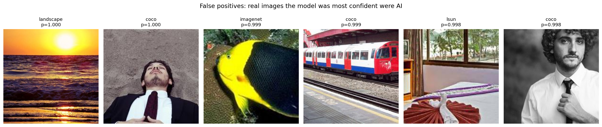
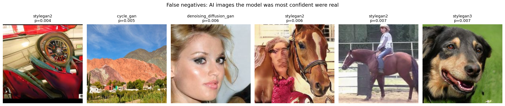

# Robust Detection of AI-Generated Images Under Real-World Transformations

TikTok TechJam 2026, Track 5.

A detector that distinguishes AI-generated images from real photographs, built
and evaluated specifically for the conditions images actually arrive in:
compressed, resized, cropped and filtered.

> **TODO:** add a hero image here. Suggested: a side-by-side of one true
> positive and one false positive with their confidence scores, or a screenshot
> of the demo UI.

---

## 1. Project Overview

Most published AI-image detectors report accuracy on pristine images. In
deployment, images have been through a social platform first: re-encoded,
downscaled for thumbnails, cropped to a profile frame, auto-enhanced. This
project asks how much of that reported accuracy survives.

**What was built:**

- A fine-tuned **ConvNeXt-Tiny** binary classifier (28M parameters, well under
  the 2B limit) trained on 20 different generator architectures.
- A **hand-crafted feature baseline**: Sobel gradient statistics and 2D FFT
  radial energy features fed to random forests. Built as a control, to test
  whether explicit frequency features are competitive.
- A **composable degradation harness** that applies any chain of transformations
  at fixed parameters, so the same evaluation runs across 13 conditions
  including realistic multi-step chains.
- A **batch CLI** (`detect.py`) that scores an image directory to JSON.

**Headline result:** the learned detector loses 0.090 AUC going from clean
images to the worst degradation chain. The hand-crafted frequency baseline loses
0.244 over the same range, falling below chance. Frequency features are not just
weaker, they are structurally vulnerable to exactly the transformations that
matter.

---

## 2. Setup and Installation

```bash
git clone <REPO-URL>
cd <REPO-NAME>
python -m venv .venv
source .venv/bin/activate        # Windows: .venv\Scripts\activate
pip install -r requirements.txt
python download_models.py
```

`download_models.py` pulls the weights from
[ParthMalik6/rf-cnn](https://huggingface.co/ParthMalik6/rf-cnn) into `./models`:

Download the weights and place them in the repository root (or any directory,
passed via `--models`):

```
best_model.pth        ConvNeXt-Tiny fine-tuned weights
rf_gradient.joblib    random forest, 14 gradient features
rf_fft.joblib         random forest, 9 FFT features
rf_combined.joblib    random forest, all 23 features
```

`scikit-learn` is pinned in `requirements.txt`. The random forests were
serialized with that exact version, and loading them under a different one
produces an `InconsistentVersionWarning` and potentially wrong predictions.

Runs on CPU or GPU. `torch.load` uses `map_location`, so a GPU is not required.

---

## 3. Usage

### Batch scoring (the required deliverable)

```bash
python detect.py --input ./images --output results.json
```

Output:

```json
[
  {"image_path": "images/photo1.jpg", "pred": 0.8734},
  {"image_path": "images/photo2.jpg", "pred": 0.0121}
]
```

`pred` is the confidence that the image is AI-generated, from 0.0 (confidently
real) to 1.0 (confidently generated).

**Flags:**

| Flag | Default | Purpose |
|---|---|---|
| `--input` | required | directory of images |
| `--output` | `results.json` | output path |
| `--models` | `.` | directory holding the weight files |
| `--recursive` | off | also walk subdirectories |
| `--per-model` | off | include each branch's individual score |
| `--threshold` | `0.35` | decision threshold for the printed summary |
| `--rf-weight` | `0.0` | ensemble weight on the random forest (see §6) |
| `--batch-size` | `32` | images per forward pass |

### Single image

```bash
python scoring.py path/to/image.jpg
```

---

## 4. Approach

### 4.1 Data

**ArtiFact** (Awsaf et al., ICIP 2023): 2,496,738 images, 25 generators (13 GAN,
7 diffusion, 5 miscellaneous) and 8 real-image sources, all at 200x200.

ArtiFact was chosen over the suggested datasets for a specific reason. CIFAKE
contains a single generator (Stable Diffusion 1.4), so a detector trained on it
cannot be evaluated for cross-architecture generalization. WildFake has the
diversity but ships as a 1.29TB archive with a single 47GB GAN blob, which is
impractical at hackathon scale.

**Sampling.** 120,000 images were drawn: 60,000 real, 30,000 GAN, 30,000
diffusion. Balanced real-versus-fake at 60k/60k.

Within each class, quotas were spread evenly across sources with automatic
redistribution when a source ran short. This matters: `stylegan2` alone holds
1,000,000 images, 80% of all GAN data in ArtiFact. Uniform random sampling would
have produced a StyleGAN2 detector. Every architecture is capped so no single
generator dominates.

The 5 miscellaneous generators (inpainting and editing models) were excluded to
keep the task to full-image synthesis detection.

**Splits.** 80/10/10, stratified by source, so every architecture appears in
train, validation and test in the same proportion.

> **Known limitation:** every generator appears in both train and test. The
> reported numbers measure "can it detect generators it has seen," not "can it
> detect an unseen generator." See §8.

### 4.2 Model

ConvNeXt-Tiny, ImageNet-pretrained, single output neuron with
`BCEWithLogitsLoss`.

**Why full fine-tuning rather than a frozen backbone.** ImageNet features encode
object semantics, and a real photo of a dog and a StyleGAN dog both encode as
"dog." The distinguishing signal lives in texture and upsampling statistics,
which ImageNet training explicitly learns to discard as nuisance variation. A
linear probe on frozen features cannot recover information the early layers have
already thrown away, so the whole network is fine-tuned.

**Training configuration:**

| | |
|---|---|
| Optimizer | AdamW, weight decay 0.05 |
| Learning rate | 5e-4 |
| Schedule | linear warmup over epoch 1 (per batch), then cosine decay (per epoch) |
| Epochs | 15 |
| Batch size | 64 |
| Precision | mixed (AMP) |
| Regularization | `drop_path_rate=0.1` |
| Checkpoint | best mean of clean and degraded validation accuracy |

### 4.3 Training augmentation

Augmentation deliberately mirrors the deployment degradations rather than the
usual flip-and-crop recipe:

```python
HorizontalFlip(p=0.5)

OneOf([ImageCompression(q=30..95),
       GaussianBlur(sigma=0.3..2.2),
       Downscale(0.25..0.75)], p=0.7)

OneOf([GaussNoise(0.01..0.12),
       ColorJitter(0.2)], p=0.5)

RandomResizedCrop(224, scale=0.7..1.0)
```

Two choices worth noting. `OneOf` rather than stacking, so images are damaged
one way at a time and 30% pass through nearly clean, preserving clean-image
accuracy. And **continuous ranges wider than the evaluation points**: the
evaluation tests JPEG at exactly 90/70/50/30, while training samples uniformly
from 30 to 95. The model learns the degradation, not four memorized settings.

### 4.4 Learning rate: what was tried

The first two runs underfit. Both are reported because the diagnosis mattered
more than either result.

| Run | LR | Epochs | Data | Train acc | Val clean | Outcome |
|---|---|---|---|---|---|---|
| 1 | 2e-4 | 10 | 40k | 0.767 | 0.759 | underfit, LR reached 0 while still improving |
| 2 | 1e-3 | 15 | 40k | 0.916 | 0.747 | overfit after epoch 9, no better than run 1 |
| 3 | 5e-4 | 15 | 40k | 0.916 | 0.759 | overfitting from epoch 9 |
| 4 | 5e-4 | 15 | **120k** | 0.887 | **0.795** | shipped |

A 5x change in learning rate moved validation accuracy by less than a point,
which ruled out optimization as the bottleneck. The train/validation gap opening
at epoch 9 in run 3 identified data volume instead. Tripling the dataset gained
3.6 points of clean validation accuracy. The gap persists at 120k, so more data
would still help, with diminishing returns.

### 4.5 Threshold selection

Selected on **validation**, never on test. Accuracy was flat from 0.30 to 0.50
(0.793 to 0.796, a difference of 3 images out of 3,981), so accuracy alone does
not determine the cut. **0.35** was chosen as the point where real-image and
fake-image accuracy are balanced (0.796 and 0.794), which is the neutral default
when neither error type is stated to be costlier.

---

## 5. Robustness Evaluation

All conditions applied at fixed parameters to the held-out test split. Every
image receives identical treatment, so the numbers are reproducible.

> **TODO:** paste `robustness_table.csv` here as a markdown table. Generate it
> with `robust_df.to_markdown(index=False)`.

<!-- ROBUSTNESS TABLE GOES HERE -->

> **TODO (optional):** a line chart with condition on the x-axis and AUC on the
> y-axis, one line per branch (CNN, gradient, FFT, combined). The visual gap
> between the CNN line and the FFT line widening toward the right is the whole
> finding in one picture. Save as `docs/robustness_curve.png`.

### What the table shows

**The learned detector degrades gracefully.** AUC falls from 0.880 clean to
0.790 under the worst chain (blur 1.0 + 50% downscale + JPEG-30), a 0.090 drop.
Under JPEG-30 alone it holds at 0.855.

**The frequency baseline collapses.** FFT features fall from 0.735 to 0.491,
below chance, a 0.244 drop. Nearly three times the CNN's degradation.

| Branch | Clean | Worst case | Drop |
|---|---|---|---|
| CNN | 0.880 | 0.790 | **-0.090** |
| FFT (9 features) | 0.735 | 0.491 | **-0.244** |
| Gradient (14 features) | 0.604 | 0.563 | -0.041 |
| Combined (23 features) | 0.754 | 0.567 | -0.187 |

This is not a coincidence of tuning. The FFT features measure energy in
high-frequency radial bins, and JPEG compression works by transforming blocks
into frequency space and quantizing away high-frequency coefficients. JPEG is
mechanically a device for deleting the quantity these features measure. Gaussian
blur does the same by low-pass filtering. **Any detector built on explicit
frequency statistics inherits this vulnerability**, regardless of the classifier
sitting on top.

Note that the frequency baseline was trained *with* the full degradation
pipeline. It saw compressed and blurred images throughout training and collapses
anyway. Augmentation can teach a model to cope with degraded input only if the
feature it depends on survives the degradation. This one does not.

**Blur and rescaling hurt more than compression.** Counter to the emphasis in
much of this literature, JPEG is not the main threat to the learned detector:

| Condition | CNN AUC | Drop from clean |
|---|---|---|
| blur_2.0 | 0.832 | -0.048 |
| rescale_0.25 | 0.837 | -0.043 |
| social_media (0.5x + JPEG-70) | 0.842 | -0.038 |
| jpeg_30 | 0.855 | -0.025 |

Resampling and defocus are the weak points. A deployment pipeline that resizes
before storing is a bigger risk than one that compresses aggressively.

---

## 6. Ensemble: a tested and rejected component

The gradient and FFT branches were combined with the CNN as a weighted blend and
evaluated across all 13 conditions.

| Condition | CNN AUC | Ensemble AUC | Delta |
|---|---|---|---|
| clean | 0.8803 | 0.8841 | +0.0038 |
| jpeg_30 | 0.8552 | 0.8592 | +0.0040 |
| blur_2.0 | 0.8324 | 0.8295 | **-0.0029** |
| worst_case | 0.7896 | 0.7849 | **-0.0047** |

The ensemble adds 0.004 AUC on clean images and *reduces* performance under
heavy degradation, which is the regime the task is about. **The shipped system
therefore uses the CNN alone** (`--rf-weight 0.0`).

The hand-crafted branch is retained in the repository. It is reachable via
`--rf-weight` so the experiment is reproducible, and the robustness comparison
above is the most informative result the project produced.

---

## 7. Error Analysis

Measured on the clean test split at the shipped threshold of 0.35.

> **TODO:** fill in from the notebook:
> ```
> overall accuracy:     ____
> false positive rate:  ____   (real images called AI)
> false negative rate:  ____   (AI images called real)
> ```

### 7.1 The failures are confident, not borderline

> **TODO:** embed `false_positives.png` here.
> Caption: *Real photographs the model was most confident were AI-generated.
> A landscape and a COCO portrait both at p=1.000.*



> **TODO:** embed `false_negatives.png` here.
> Caption: *AI-generated images the model was most confident were real.
> Note the fourth and fifth panels: StyleGAN2 horse images with visibly
> corrupted riders, scored at p=0.006 and p=0.007.*



The most important observation is not the error rate but where the errors sit.
These are not marginal cases near the decision boundary. An ordinary sunset
photograph scores p=1.000 for AI. A StyleGAN2 image containing an anatomically
impossible rider, obvious to any human in under a second, scores p=0.007 for AI.

The model is not reasoning about content or plausibility. It reads low-level
texture statistics, and those statistics can point confidently the wrong way. No
threshold adjustment fixes this, because the errors are at the extremes of the
score distribution rather than near the cut. **The confidence values rank images
usefully but should not be read as calibrated probabilities.**

### 7.2 Difficulty tracks generator quality, not generator family

> **TODO:** paste `per_source_errors.csv` here, or the top and bottom 8 rows.

<!-- PER-SOURCE ERROR TABLE GOES HERE -->

Error rates within the GAN family span more than a hundredfold:

| Source | Type | Error rate |
|---|---|---|
| stylegan3 | FN | 0.478 |
| diffusion_gan | FN | 0.457 |
| pro_gan | FN | 0.453 |
| stylegan2 | FN | 0.397 |
| ... | | |
| gansformer | FN | 0.065 |
| cips | FN | 0.065 |
| sfhq | FN | 0.012 |
| star_gan | FN | 0.004 |

The common assumption that GANs are easier to detect than diffusion models does
not hold. `star_gan` is detected almost perfectly while `stylegan3` evades
detection nearly half the time, and both are GANs. What predicts difficulty is
how good the generator is, not which family it belongs to.

### 7.3 A symmetric failure mode on faces

The worst false negatives (`stylegan2`, `stylegan3`, `pro_gan`) are all face
generators. The real sources with high false-positive rates include `ffhq`
(0.207) and `celebahq` (0.130), which are face datasets.

This is one failure appearing twice. StyleGAN was trained on FFHQ with the
explicit objective of producing images indistinguishable from it, and it largely
succeeded. The detector confuses the two in both directions.

### 7.4 Art is misclassified as generated

`metfaces` (real paintings and drawings) has a **0.319** error rate, among the
highest of any real source. The model has partially learned "not photographic,
therefore generated."

For a content-moderation deployment this is a serious and specific failure:
digitized artwork would be systematically flagged as AI-generated. It also
suggests the model relies on photographic texture as a positive signal for
"real" rather than detecting generation artifacts directly.

### 7.5 Trade-offs

**Threshold.** Validation accuracy is flat from 0.30 to 0.50, so the choice is
purely about which error to prefer. At 0.35 the two rates are balanced. Raising
to 0.50 reduces false positives on real photographs, at the cost of missing more
of the already-difficult StyleGAN images. A moderation system that penalizes
users for false accusations should raise it; a forensic screening tool should
lower it.

**Learned versus hand-crafted features.** Hand-crafted features are
interpretable, cheap, and need no GPU. They are also 0.15 AUC worse on clean
images and collapse under compression. For this task the interpretability is not
worth the robustness cost.

**Resolution.** All inputs are resized to 224x224. This normalizes scale so that
degradation effects are measured cleanly, but it also destroys some
high-frequency signal via interpolation. Since the task is explicitly about
surviving compression and blur, a model that depends on pristine high-frequency
artifacts would be the wrong model anyway.

---

## 8. Limitations and What I Would Improve

**Generators appear in both train and test.** The reported figures measure
in-distribution detection. The harder and more realistic question is performance
on a generator never seen in training. The `source` column is preserved in the
manifest specifically to make leave-one-generator-out evaluation possible, and
this is the first experiment I would run with more time.

**Training data ends at 2023.** ArtiFact predates SDXL, Midjourney v6, Flux and
current video-frame generators. Detection performance on 2026-era models is
unmeasured and likely worse.

**Native resolution is 200x200.** All training images were 200x200 upscaled to
224. High-resolution inputs are downscaled through a different resampling path
than the model saw in training, so accuracy on large modern images may be below
the reported figures.

**Confidence is not calibrated.** As §7.1 shows, the model produces p=1.000 on
ordinary photographs. Temperature scaling or isotonic regression on a held-out
set would make the scores usable as probabilities rather than only as a ranking.

**The model does not use semantics.** It misses images with visible anatomical
errors. A branch that reasons about content, or a vision-language model as a
second opinion on high-uncertainty cases, would catch a failure class the
texture-based model structurally cannot.

**Multi-class training was not tried.** Training with 21 outputs (real plus each
generator) and summing the fake probabilities at inference gives each generator
its own output to specialize on rather than forcing 20 artifact types into one
class. The ArtiFact authors report this beating binary training. This was
identified as the highest-value remaining experiment but did not fit in the time
available.

**Class structure is asymmetric.** The real class is one coherent thing
(photographs) while the fake class is 20 unrelated processes. Per generator,
real images outnumber fake roughly 20 to 1, which likely contributes to the
model's difficulty with individual high-quality generators.

---

## 9. Reproducing the Results

> **TODO:** adjust paths and notebook names to match what you actually commit.

1. **Data.** Attach the ArtiFact dataset on Kaggle. Build the manifest by
   reading `metadata.csv` from each of the 33 generator folders.
2. **Sample.** Run the sampler with `SEED = 42` and
   `TARGETS = {'real': 60000, 'gan': 30000, 'diffusion': 30000}`. The seed is
   what makes the split reproducible.
3. **Train.** `notebooks/01_train_cnn.ipynb`, roughly 90 minutes on a T4.
4. **Hand-crafted baseline.** `notebooks/02_classical_features.ipynb`,
   roughly 20 minutes.
5. **Robustness table.** `notebooks/03_robustness.ipynb`, roughly 25 minutes.
   Writes `robustness_table.csv`.
6. **Error analysis.** `notebooks/04_error_analysis.ipynb`. Writes the two
   failure-case figures.

---

## 10. Repository Structure

```
.
├── detect.py                    batch CLI, directory -> JSON
├── scoring.py                   shared model loading and scoring
├── requirements.txt
├── README.md
├── models/
│   ├── best_model.pth
│   ├── rf_gradient.joblib
│   ├── rf_fft.joblib
│   └── rf_combined.joblib
├── notebooks/
│   ├── 01_train_cnn.ipynb
│   ├── 02_classical_features.ipynb
│   ├── 03_robustness.ipynb
│   └── 04_error_analysis.ipynb
├── results/
│   ├── robustness_table.csv
│   ├── per_source_errors.csv
│   └── history.csv
└── docs/
    ├── false_positives.png
    └── false_negatives.png
```

---

## 11. Tools, Models and Data

**Frameworks:** PyTorch, timm, Albumentations, scikit-learn, pandas, NumPy,
Pillow, Matplotlib.

**Model:** ConvNeXt-Tiny (Liu et al., 2022), ImageNet-1k pretrained weights via
`timm`.

**Dataset:** ArtiFact (Awsaf et al., ICIP 2023),
<https://github.com/awsaf49/artifact>.

**Development:** Kaggle Notebooks (Tesla T4), VS Code.
